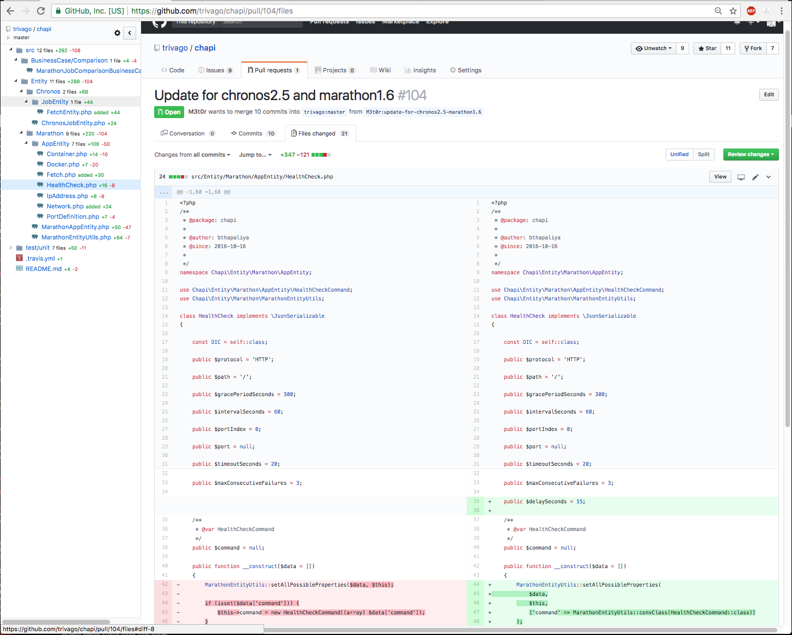

# Octotree-hack

This is a quick and **_very_** dirty hack to Buu Nguyen's commendable [Octotree Extension](https://github.com/buunguyen/octotree/)

Compared to the original extension, this adds two features to the GitHub Pull Request view:

- The page shows only _one_ file's diff at a time, this obviously being the file selected in the tree pane, so that PRs with several files become manageable
- The diff is shown in full right away, eliminating the [brain dead "unfold" buttons](https://blog.github.com/2013-12-02-expanding-context-in-diffs/) GH tries to push on you

Because I didn't want to invest valuable time into learning Octotree's ~~bloated~~ highly advanced build system, this is implemented by decompressing the compiled Chrome extension distributed by the original devs and hacking the generated octotree.js directly. Yes, it's that bad. The changed parts are indicated in the [commit history](https://github.com/ppar/octotree-hack/commit/cbfed39983cb9523d230e06fe4be0cddb65c9fd1)

## Installation

- Download / clone the "chrome" directory somewhere
- Go to chrome://extensions 
- Flip some bit in Chrome to enable developer mode
- You probably want to remove the official octocat exension at this point
- Click "Load Unpacked" => select the directory => ok

## Screenshot

